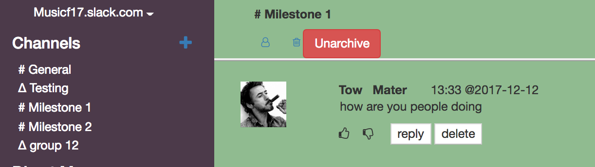

# Slack-LAMP
A Web application developed using [LAMP](https://en.wikipedia.org/wiki/LAMP_(software_bundle)) stack to create channels, send messages and manage users within a workspace. The application has a look and feel similar to [Slack](https://slack.com/).

# Features
## 1. Messages
- Users can post messages, code snippets, upload files and insert pictures either from the local system or image URL.
- Replies can be posted to messages as threads.

  | Sample Message                                             | Threads                                                    |
  |------------------------------------------------------------|------------------------------------------------------------|
  |         |       |
  
## 2. Pagination and Reactions
- Users can react to the messages by either upvoting '+1' or downvoting '-1' reactions.
- Clicking 'Load More' option in message area loads messages that were posted earlier than the 10 current messages.
- Search bar can be used to search for existing users in the workspace.

| Initial                                       |  Pagnation                                    | Reactions              |
|-----------------------------------------------|-----------------------------------------------|------------------------|
|||| 

## 3. Channel Membership and Administration
- Users can create channels (both public and private) and invite members to the channels.
- Admins can edit channel membership, delete posts, archive and unarchive a channel.
- No further posts, reactions and channel modification are allowed in archived channels.

| Channel Archive                                                    |  Channel Creation                                     |
|-------------------------------------------------------------|--------------------------------------------------------------|
|  |   | 

## 4. CAPTCHA, Gravatar and Github Authentication
- The site is integrated with No CAPTCHA ReCAPTCHA API. Prior to editing profile, users have to complete the CAPTCHA requirement.
- User's current avatar is overrided to Gravatar image through the email ID associated with Gravatar API.
- The website can also be logged in using GitHub's credentials. The avatar is changed dynamically to the user's GitHub avatar.

| GitHub Authentication                                       | CAPTCHA                                                      |
|-------------------------------------------------------------|--------------------------------------------------------------|
|  |   | 

